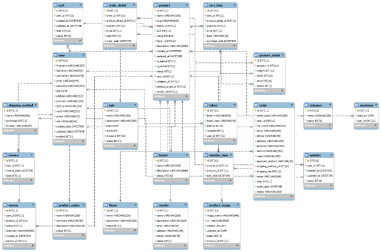

# Cà phê Filtro
## Overview
Xây dựng trang web bán cà phê đơn giản
## Mục lục
1. [Chức năng](#chức-năng)
2. [Công nghệ](#công-nghệ)
3. [Yêu cầu](#yêu-cầu)
4. [Cài đặt](#cài-đặt)
5. [Sử dụng](#sử-dụng)

## Chức năng


- User:
    - Đăng ký, đăng nhập, đăng xuất, quên mật khẩu
    - Xem, sửa thông tin cá nhân
    - Xem danh sách sản phẩm
    - Xem chi tiết sản phẩm
    - Tìm kiếm sản phẩm
    - Thêm, xóa sản phẩm yêu thích
    - Thêm, xóa sản phẩm vào giỏ hàng (có thể chuyển giỏ hàng lúc chưa đăng nhập vào giỏ hàng sau khi đăng nhập)
    - Xem giỏ hàng
    - Thanh toán online (COD, Momo, Vnpay)
    - Xem lịch sử đơn hàng
    - Đánh giá sản phẩm
    - Gửi phản hồi
    - **Gợi ý sản phẩm (sử dụng KNN) và chatbot => [ở đây](https://github.com/Arkadian404/recommender_system_api)
- Admin:
    - Đăng nhập, đăng xuất, quên mật khẩu
    - Quản lý sản phẩm và các bảng liên quan (danh mục, nhà cung cấp, hương vị, ...)
    - Quản lý voucher
    - Quản lý đơn hàng (xác nhận, hủy đơn hàng) => Gửi mail thông báo cho user
    - Quản lý user
    - Xem thống kê doanh thu theo mục đích (ngày, tháng, năm, sản phẩm, ...)

## Công nghệ
1. Backend:
    - Ngôn ngữ: Java, ([Python](https://github.com/Arkadian404/recommender_system_api) cho việc gợi ý sản phẩm)
    - Framework: Spring Boot, Spring Security, Spring Data JPA, Hibernate
    - Database: MySQL
    - Công cụ: Docker, Git, Github, Postman, Swagger
    - Khác: JWT, Mail, ...
2. Frontend: ==> [Angular](https://github.com/Arkadian404/filtro_jwt)

## Yêu cầu
1. Java 17+
2. Maven
3. MySQL 8.0+
4. [Angular 16+](https://github.com/Arkadian404/filtro_jwt) (cho phần frontend)
5. [Python 3.10+](https://github.com/Arkadian404/recommender_system_api) (cho việc gợi ý sản phẩm)

## Cài đặt
1. Clone project
```bash
git clone https://github.com/Arkadian404/filtro_jwt_backend.git
```
2. Tạo database `filtro` (hoặc tên mong muốn) trong MySQL bằng file dataSample.sql trong thư mục `db` của project
3. Mở project bẳng IDE (IntelliJ, Eclipse, ...)
4. Cấu hình thông tin database trong file `application.yml` ví dụ:
```yml
spring:
  datasource:
    url: jdbc:mysql://localhost:3306/filtro #tên host, port, database thay đổi tùy theo cấu hình MySQL
    username: root #username của MySQL
    password: 123456 #password của MySQL
    driver-class-name: com.mysql.cj.jdbc.Driver
  mail:
    host: smtp.gmail.com
    port: 587
    username: email #email gửi mail
    password: password #password email (cần bật quyền truy cập cho ứng dụng kém an toàn)
```
5. Build và chạy project

Thông thường IDE sẽ tự động tải các thư viện cần thiết từ Maven repository và nếu như thư viện chưa được tải tự động như yêu cầu trong file `pom.xml`, hãy chạy lệnh sau:
```bash
mvn clean install
```
Sau đó chạy project bằng IDE hoặc lệnh sau:
```bash
mvn spring-boot:run
```

## Sử dụng
- Sau khi cài đặt xong phần backend (phần frontend theo hướng dẫn [ở đây](https://github.com/Arkadian404/filtro_jwt)) port mặc định là 8080, truy cập vào phần Swagger để xem các API và test: `http://localhost:8080/swagger-ui.html`
- Phần gợi ý sản phẩm và chatbot là optional (có thể bỏ qua), xem [ở đây](https://github.com/Arkadian404/recommender_system_api)
- Do việc sử dụng JWT để xác thực và phân quyền nên cần phải đăng nhập để lấy token, sau đó thêm token vào header của mỗi request trong Swagger
- Về phần thanh toán online (thanh toán với VNPAY) cần phải lưu ý các yêu cầu sau:
    - Trước hết cần phải có tài khoản test merchant trên [VNPAY](https://sandbox.vnpayment.vn/merchantv2/)
    - Sau khi đăng ký tài khoản và có được các thông tin cần thiết như `vnp_TmnCode`, `vnp_HashSecret` cần phải cấu hình trong file `application.yml`:
    ```yml
  vnpay:
    vnpay_TmnCode: #vnp_TmnCode
    vnpay_HashSecret: #vnp_HashSecret
  ```
    - VNPAY yêu cầu phải có địa chỉ IP public và https để có thể gửi IPN về backend, nên cần phải tunnelling localhost ra public IP (sử dụng Serveo để tunnelling) bằng lệnh sau:
    ```bash
    ssh -R 80:localhost:8080 serveo.net
    ```
    - Sau khi có được địa chỉ public, cần phải cấu hình trong phần cài đặt merchant của VNPAY để gửi IPN về địa chỉ public đó (ví dụ: `https://your-public-ip/api/v1/webhook/vnpay/ipn`)
- Về phần MOMO thì chỉ cần thay đổi phần IPN_URL trong file `service/MomoService` bằng địa chỉ public của Serveo
```java
private static final String IPN_URL = "https://your-public-ip;
```

